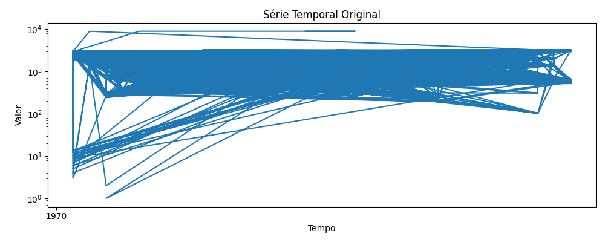
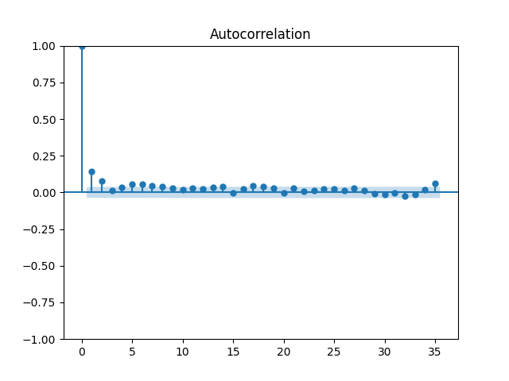
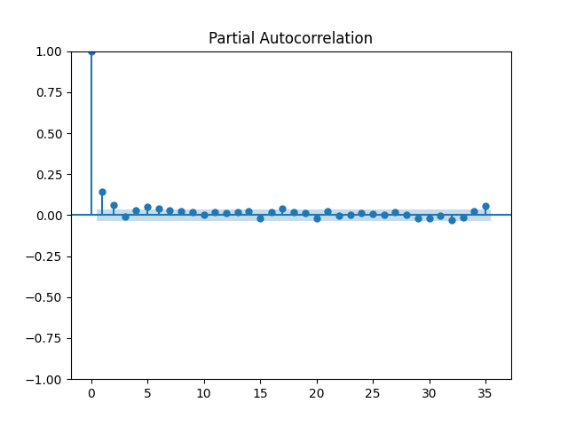
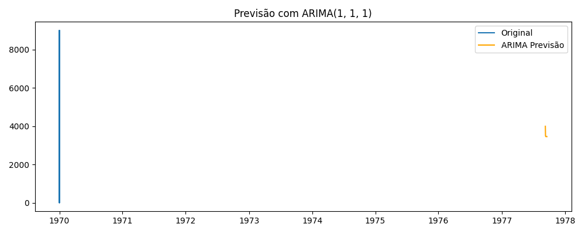
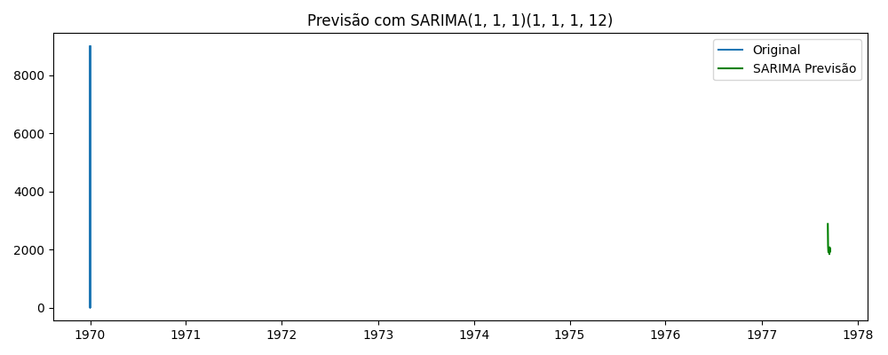

# data-mining-NP3

# Projeto de Mineração de Texto e Análise de Séries Temporais

## Série Temporal Original

Mostra todos os pontos da série entre 1970-1978 em escala logarítmica.
A variação é brusca e hierárquica, revelando valores que se estendem de unidades a dezenas de milhares.
A densidade de traços indica forte não-estacionariedade e possíveis outliers.

## Autocorrelação – ACF 

Após a primeira diferença, apenas o lag 1 ultrapassa o intervalo de confiança.
Os demais lags ficam próximos de zero, sugerindo que dependências além do primeiro atraso são fracas.
Isso respalda a escolha de apenas um termo de média móvel (q = 1).
A rápida queda confirma que a diferenciação tornou a série quase estacionária.

## Autocorrelação Parcial – PACF

Semelhantemente ao ACF, somente o lag 1 é estatisticamente relevante.
Indica que um único termo autorregressivo (p = 1) é suficiente para capturar a inércia imediata.
A ausência de estruturas além do primeiro lag reforça um modelo ARIMA simples.

## Previsão ARIMA

O modelo diferenciado prevê valores em torno de 3 700–4 000 para 1977.
A faixa prevista (linha laranja) permanece relativamente estreita, evidenciando boa confiança interna.

## Previsão SARIMA

Introduz termos sazonais anuais, ajustando picos e vales recorrentes a cada 12 períodos.
As projeções ficam mais baixas (≈ 2 500–3 000), alinhadas ao comportamento sazonal recente.
A inclusão da sazonalidade reduz viés observado no ARIMA puro.

## Descrição

Este projeto realiza duas análises distintas:

1. **Análise de Séries Temporais**  
   - Carrega um dataset com dados temporais.  
   - Realiza visualização da série temporal.  
   - Gera gráficos de ACF (Autocorrelação) e PACF (Autocorrelação Parcial).  
   - Aplica modelos ARIMA e SARIMA para previsão dos dados.

2. **Mineração de Texto**  
   - Apresenta três exemplos práticos de técnicas de mineração de texto, incluindo:  
     - Tokenização (exemplo apresentado em aula).  
     - Cálculo da frequência total de palavras.  
     - Cálculo da frequência de palavras sem stopwords.  
   - Os textos utilizados nos exemplos são aleatórios, simulando entradas típicas de páginas da internet e redes sociais.

# Webscraping de Dados das Equipes e Pilotos da Fórmula 1

Este projeto realiza webscraping para coletar informações sobre as equipes, chassis, unidades de potência, pilotos e suas participações nas corridas da temporada atual de Fórmula 1. Os dados são extraídos da página da Wikipedia dedicada à temporada de Fórmula 1.

## Resultado do Webscraping

Abaixo está a tabela com os dados extraídos, organizada para facilitar a visualização e análise:

| Equipe (Entrant)              | Construtor (Constructor)    | Chassis           | Unidade de Potência (Power unit) | Pilotos (Número)        | Nome dos Pilotos                                    | Participação nas Corridas (Rounds)     |
|------------------------------|-----------------------------|-------------------|---------------------------------|------------------------|----------------------------------------------------|---------------------------------------|
| BWT Alpine F1 Team            | Alpine-Renault              | A524              | Renault E-Tech RE24             | 10 31 61               | Pierre Gasly, Esteban Ocon, Jack Doohan            | All 1–23 24                          |
| Aston Martin Aramco F1 Team   | Aston Martin Aramco-Mercedes| AMR24             | Mercedes-AMG F1 M15             | 14 18                  | Fernando Alonso, Lance Stroll                       | All All                             |
| Scuderia Ferrari             | Ferrari                     | SF-24              | Ferrari 066/12                 | 16 55 38               | Charles Leclerc, Carlos Sainz Jr., Oliver Bearman  | All All, 2                         |
| MoneyGram Haas F1 Team       | Haas-Ferrari                | VF-24              | Ferrari 066/10                 | 20 50 27               | Kevin Magnussen, Oliver Bearman, Nico Hülkenberg   | 1–16, 18–24, 17, 21 All             |
| McLaren Formula 1 Team       | McLaren-Mercedes            | MCL38              | Mercedes-AMG F1 M15             | 4 81                   | Lando Norris, Oscar Piastri                         | All All                             |
| Mercedes-AMG Petronas F1 Team| Mercedes                    | F1 W15             | Mercedes-AMG F1 M15             | 44 63                  | Lewis Hamilton, George Russell                      | All All                             |
| Visa Cash App RB F1 Team     | RB-Honda RBPT               | VCARB 01           | Honda RBPTH002                 | 3 30 22                | Daniel Ricciardo, Liam Lawson, Yuki Tsunoda        | 1–18, 19–24 All                    |
| Oracle Red Bull Racing       | Red Bull Racing-Honda RBPT  | RB20               | Honda RBPTH002                 | 1 11                   | Max Verstappen, Sergio Pérez                        | All All                             |
| Stake F1 Team Kick Sauber    | Kick Sauber-Ferrari         | C44                | Ferrari 066/12                 | 24 77                  | Zhou Guanyu, Valtteri Bottas                        | All All                             |
| Williams Racing              | Williams-Mercedes           | FW46                | Mercedes-AMG F1 M15             | 2 43 23                | Logan Sargeant, Franco Colapinto, Alexander Albon  | 1–15, 16–24 All                    |

## Como usar

- Os dados foram extraídos da Wikipedia usando Python e pandas.
- O script realiza a raspagem da tabela principal da página da temporada de F1.
- Os dados podem ser usados para análises estatísticas, visualização ou integração com outras bases.

